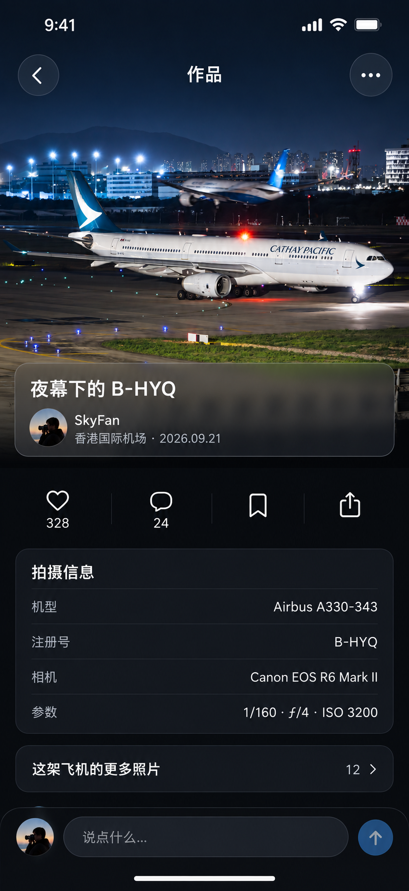
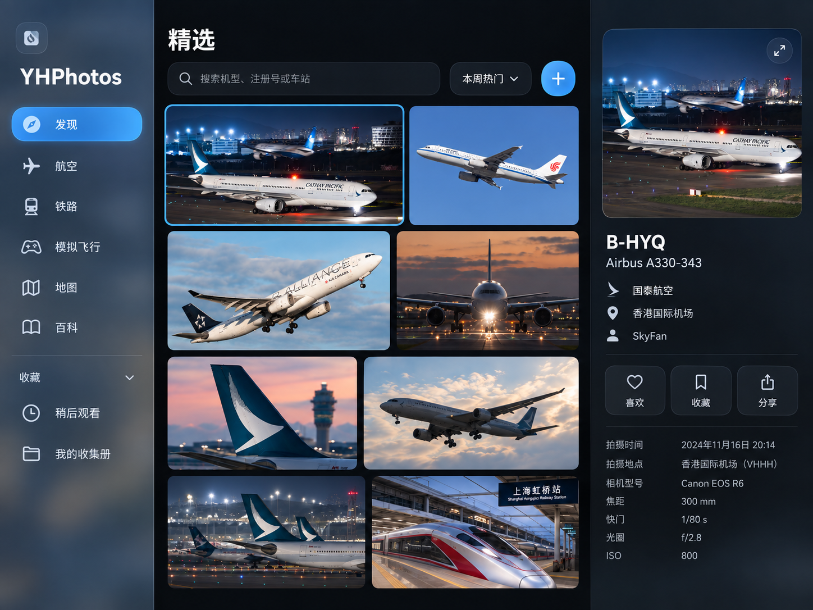
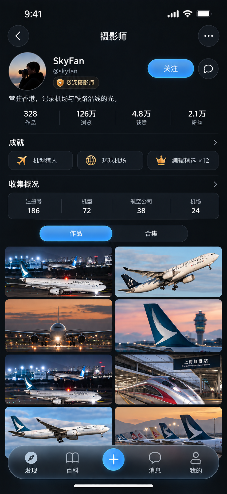
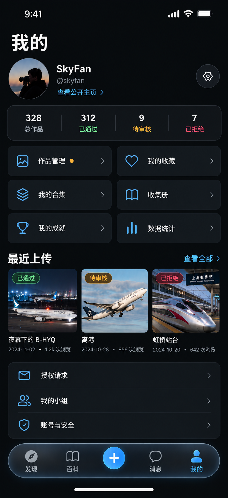
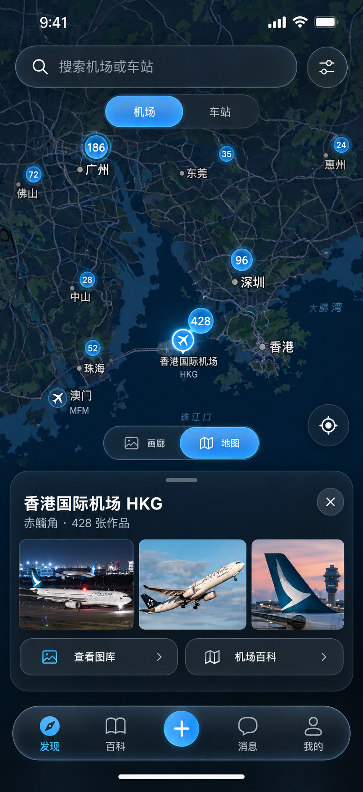
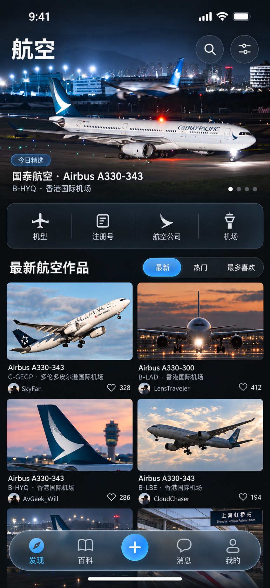
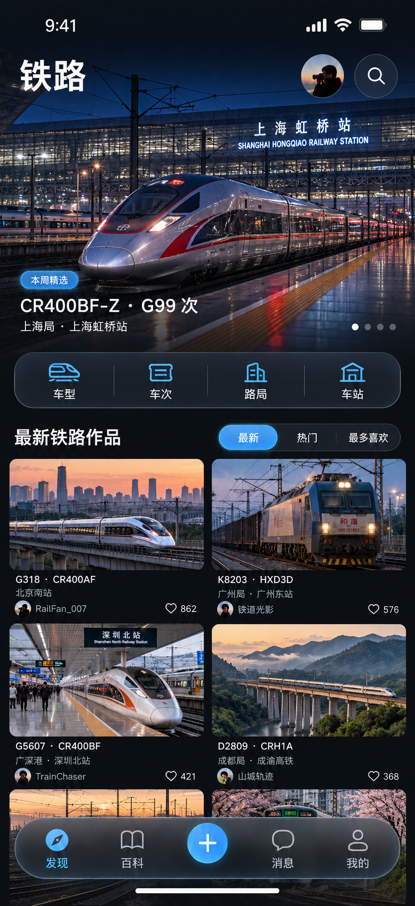
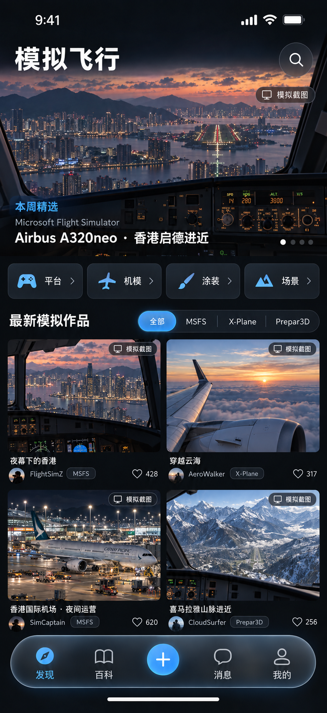

# YHPhotos iOS / iPadOS 视觉方向

这组图用于确定产品气质、信息层级和自适应原则，不是最终逐像素 UI。图片内的摄影作品仅作概念展示；开发时应从 YHPhotos API 加载真实作品。

## 参考图

### iPhone · 发现

### iPhone · 作品详情

### iPad · 分栏图库

### iPhone · 外部用户主页

### iPhone · 本人用户中心

### iPhone · 地图浏览

### iPhone · 航空分区

### iPhone · 铁路分区

### iPhone · 模拟飞行分区

### iPhone · 首页社区统计

## 核心判断

YHPhotos App 不应该是网站的缩小版。网站负责完整入口、运营内容和高密度信息；App 应该像一个面向拍摄现场和日常浏览的「原生摄影灯箱」：打开就看作品，搜索和识别更快，上传路径更短。

产品气质是「航空摄影暗房 + Apple 原生层级」：照片提供色彩，界面退到近黑和冷灰；品牌天蓝只表示选中、进度和主要动作。

## 信息架构

iPhone 主导航建议固定为五项：

1. 发现：精选、航空、铁路、模拟飞行，以及画廊 / 地图切换。
2. 百科：机型、注册号、航空公司、机场、车型、车站等实体入口。
3. 上传：居中的主要动作，进入原生分步上传流程。
4. 消息：评论、点赞、审核结果、活动通知。
5. 我的：作品、收藏、收集册、器材与账号设置。

活动、排行、小组、资讯等网站栏目不全部占据主导航，可从发现页专题、搜索结果或「我的」中的二级入口进入。

## 毛玻璃规则

- 毛玻璃只用于导航、筛选、临时浮层和操作工具，不覆盖照片主体，也不把每个内容区都做成玻璃卡片。
- iPhone 主 Tab 栏必须是独立悬浮 Dock：左右和底部均与屏幕边缘分离，四周都能看到内容背景。
- Dock 建议距左右安全区 `16–20 pt`，距 Home Indicator 所在安全区上沿 `12–18 pt`；内容滚动区需增加底部 inset，避免被 Dock 遮挡。
- Dock 是一个连续材质容器，不是五个独立玻璃按钮。中间上传按钮可以轻微抬高，但仍属于同一个 Dock。
- 深色模式以低亮度高透材质为主；浅色模式提高描边和文字对比，避免乳白雾面吞掉照片。
- 开启「降低透明度」时自动退化为高不透明度系统背景；开启「增强对比度」时强化分隔线和选中态。

## iPhone 自适应

- 顶部使用系统大标题、搜索和可横向滚动的分类筛选，不使用网站 Header 或汉堡菜单。
- 发现页优先展示一张沉浸式精选作品，再进入双列图库；小屏设备可退化为单列或更紧凑的等宽网格。
- 详情页先看大图，再呈现社交操作、拍摄参数和实体关系。不要移植网站的面包屑、左右栏和整页卡片堆叠。
- 横屏时隐藏大标题并压缩工具栏；图片采用 aspect-fit，操作区可以变为右侧检查器。

## 页面级交互建议

### 外部用户主页

- 首屏顺序固定为身份、关注 / 私信、作品影响力、成就、收集概况、公开作品。
- 举报、拉黑等低频操作收进右上角菜单，不与关注按钮并列争夺视觉权重。
- 「作品 / 合集」使用系统分段控件；滚动后个人身份可折叠进紧凑导航栏。
- 本人查看自己的公开主页时，用「编辑资料」替代关注和私信，不另做一套布局。

### 本人用户中心

- 先显示作品审核状态，再显示功能入口；待审核、拒绝和授权请求可带 Badge。
- 首页只放高频入口：作品管理、收藏、合集、收集册、成就、统计。安全设置、API 发布、评审团等放入二级列表。
- 最近上传使用横向列表，同时显示审核状态；点击拒绝作品应直接进入审核意见与标注页面。
- 邮箱、密码、二步验证和登录设备不在概览页暴露，统一进入「账号与安全」。

### 地图

- 地图铺满屏幕，搜索、机场 / 车站切换、定位和画廊 / 地图切换都作为悬浮控件。
- 默认使用聚合数量，缩放后才展开单个机场或车站，避免标记淹没底图。
- 选中地点后用可拖动的底部 Sheet 展示缩略图和图库 / 百科入口；Sheet 永远停在主 Dock 上方。
- iPad 上地点列表进入左侧栏，地图居中，选中地点的照片和资料进入右侧 inspector。

### 航空、铁路、模拟飞行

- 三个分区共用「精选图 → 实体快捷入口 → 排序 → 作品流」骨架，降低学习成本。
- 航空实体快捷入口：机型、注册号、航空公司、机场。
- 铁路实体快捷入口：车型、车次、路局、车站。
- 模拟飞行实体快捷入口：平台、机模、涂装、场景；所有作品持续显示「模拟截图」标识，避免与实拍混淆。
- 分区差异主要来自元数据和照片内容，不为每个分区创造一套独立主题色。

### 首页社区统计组件

- 移动端不照搬 Web 的四列统计卡。首页只放一个可展开的「社区概况」组件。
- 折叠态只显示待审核、用户、作品、今日增量和在线审核员数量。
- 点按后用 Sheet 展开完整统计、审核员状态和审核入口；普通用户看不到无权限的审核动作。
- 组件位于精选图与作品流之间，信息权重低于照片，高于普通推荐区块。

## iPad 自适应

- 使用 `NavigationSplitView` 思路：左侧栏目、中间图库、右侧照片检查器。
- 窄分屏退化为两栏，检查器通过详情导航或 inspector 呈现；全屏横向时再显示三栏。
- 支持键盘搜索、方向键切换作品、空格快速预览、拖放上传和多选收藏。
- iPad 不使用放大的 iPhone 悬浮底栏；主导航迁移到侧栏，工具操作留在顶部或检查器。
- 外部用户主页在中栏显示个人资料与作品，右栏可显示选中作品；本人用户中心以侧栏列出管理分区，中栏展示当前任务。
- 航空、铁路、模拟飞行在 iPad 侧栏中作为发现的子分区，不重复放置 iPhone 式实体快捷卡。

## 系统版本策略

- 最低目标按 iOS / iPadOS 17 设计，基础导航、布局、动态字体和无障碍在 17 上完整可用。
- 视觉能力采用渐进增强：17 使用系统 `Material` 达成可靠的模糊与层级；26、27、28 及后续系统若提供更新的原生玻璃效果，由统一的 `GlassSurface` 语义组件按可用性切换。
- 业务页面不得直接依赖某一代玻璃 API。先定义 `floatingDock`、`navigationChrome`、`floatingControl`、`inspector` 四类语义，再由平台适配层决定具体材质。
- 不用自绘高斯模糊去伪装新系统效果；旧系统的目标是层级正确、性能稳定、可读性达标，而不是逐像素模拟未来系统。

## 建议视觉 token

| Token | 建议值 / 含义 |
| --- | --- |
| `canvas` | `#080A0D`，暗色图库背景 |
| `contentPrimary` | 系统主文字色 |
| `contentSecondary` | 系统次要文字色 |
| `accent` | `#4BB8F4`，只用于选中和主动作 |
| `photoRadiusPhone` | `14–18 pt` |
| `photoRadiusPad` | `10–14 pt` |
| `dockRadius` | 约为 Dock 高度的一半，形成连续胶囊 |
| `dockHorizontalMargin` | `16–20 pt` |
| `dockBottomGap` | `12–18 pt`，与 Home Indicator 分离 |

## 与 Web 端刻意拉开的差异

- 不保留桌面横向导航、首页十多个运营区块和统计卡片。
- 不使用极光背景、网页式玻璃面板阵列或大段营销文案。
- 不在照片上堆叠大量标签；默认只显示最有辨识度的实体和作者信息。
- 上传、搜索、地图和实体百科都走系统导航、Sheet、菜单、上下文操作和拖放。

## 参考图生成说明

参考图由内置 `imagegen` 生成，使用了同目录 Web 项目的品牌图标与示例航空照片作为内容和气质参考。

- `01`：原生照片优先的 iPhone 发现页；最终修订要求底部五项导航成为四周脱离屏幕边缘的悬浮 Liquid Glass Dock。
- `02`：沉浸式大图、紧凑拍摄信息和底部评论输入的 iPhone 详情页。
- `03`：侧栏、图库、检查器组成的 iPad 三栏工作区。
- `04`：他人视角的摄影师主页，包含关注、私信、成就、收集概况与公开作品。
- `05`：本人用户中心，突出审核状态、作品管理与账号入口。
- `06`：全屏地图、地点聚合和地点详情 Sheet。
- `07`：航空分区及机型、注册号、航司、机场快捷入口。
- `08`：铁路分区及车型、车次、路局、车站快捷入口。
- `09`：明确标识模拟内容的平台、机模、涂装、场景分区。
- `10`：将 Web 社区统计压缩为单个移动端「社区概况」组件并嵌入发现首页。

生成约束共同包括：不用网页导航、不做营销 Hero、不堆独立巨型统计卡片、不使用霓虹或满屏玻璃、保持中文可读和系统安全区。
